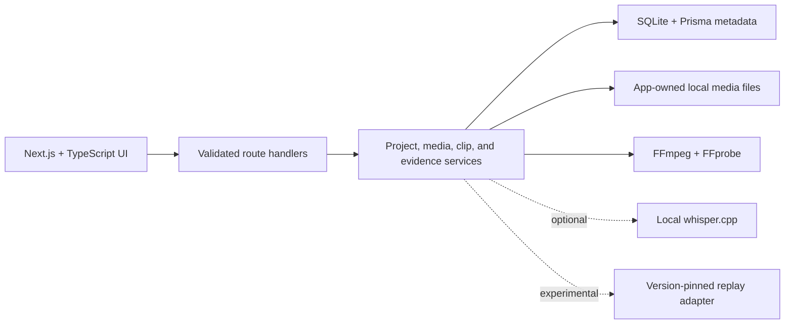

# R6 Creator AI

**Local AI-assisted gameplay media analysis platform — active development.**

R6 Creator AI is a local-first Next.js application for organizing owned
Rainbow Six Siege recordings, inspecting video metadata, creating timestamped
clips, and developing content packages without uploading gameplay to a cloud
service. It combines a TypeScript interface, SQLite persistence, streamed media,
and FFmpeg/FFprobe processing in one desktop-friendly web workspace.

> The dependable portfolio scope is the local media workflow: upload, metadata
> extraction, byte-range playback, manual timestamp clipping, clip preview and
> download, and persistent projects. Gameplay-event detection, automatic
> highlight selection, automatic editing, and Match Replay parsing are research
> prototypes. This repository does **not** claim that those features work
> reliably across recordings or game versions.

## Why this project

Long gameplay recordings are expensive to review and awkward to move between
tools. This project explores a privacy-conscious workflow where the original
media stays on the user's Mac and every generated result remains reviewable.
Experimental signals are kept separate from verified facts so an uncertain
detector result is not presented as a confirmed in-game event.

## Verified core workflow

- Stream MP4 uploads to disk with file, size, and video-stream validation.
- Extract duration, resolution, frame rate, file size, and audio-track metadata.
- Stream source videos and clips with HTTP byte-range support.
- Create clips from validated start/end timestamps using local FFmpeg.
- Preview, download, and delete generated clips.
- Save projects, metadata, clips, and writing fields in local SQLite storage.
- Return readable errors and clean up partial media after failed operations.
- Exercise service and media invariants with automated Vitest coverage.

The core workflow was also exercised during development with a real generated
MP4, including upload, probe, clip creation, streaming, download headers,
invalid-input rejection, persistence, and restart recovery.

## Active-development areas

The codebase contains additional labs for broad video/audio signals, transcripts,
manual benchmark labels, candidate review, non-destructive edit plans, local
voiceover, coaching evidence, map/operator context, and replay-provider
experiments. These modules are intentionally conservative:

- Broad scene, motion, brightness, audio, or transcript signals do not prove a
  kill, clutch, round result, room, or operator.
- Candidate scores help a person prioritize review; they do not predict views
  or guarantee that a moment is a useful highlight.
- A Match Replay adapter has been exercised against a limited fixture/package,
  but compatibility and recovered fields can vary by game/parser version.
- Export and editing paths require human review and are not described as a
  reliable automatic editor.
- No gameplay-event accuracy number is published because the repository does
  not yet contain a sufficiently representative labeled benchmark.

See [BENCHMARK.md](BENCHMARK.md) for the measurement contract and
[docs/DETAILED_GUIDE.md](docs/DETAILED_GUIDE.md) for the complete local guide
and implementation history. The final U8 audit is tracked in the
[release-readiness ledger](docs/U8_RELEASE_READINESS.md), which separates
public clean-clone checks from private retained-media verification.

## Architecture



Recordings and generated media live on disk; SQLite stores metadata and relative
paths. Long-running processes are invoked with argument arrays rather than a
shell, and uploaded filenames are never used as trusted filesystem paths.

## Stack

- Next.js, React, TypeScript, and Tailwind CSS
- SQLite and Prisma
- FFmpeg and FFprobe
- Vitest, ESLint, Prettier, and strict TypeScript
- Optional local `whisper.cpp` speech-to-text

## Run locally

Requirements: Node.js 20.9 or newer and macOS for the documented local workflow.

```bash
git clone https://github.com/Poojan-Desai/r6-creator-ai.git
cd r6-creator-ai
npm ci
npm run db:setup
npm run dev
```

Open [http://localhost:3000](http://localhost:3000). Runtime recordings,
generated clips, and SQLite files are stored in `./data` by default and are
excluded from Git. Copy `.env.example` to `.env` only when you need to change a
documented local setting.

Optional local transcription and replay experiments have separate setup steps:

```bash
npm run transcription:setup
npm run replay:setup
```

Neither is required for upload, metadata, playback, or manual clipping.

## Validate

```bash
npm run format:check
npm run lint
npm run typecheck
npm test
npm run build
```

CI runs the same static checks, test suite, and production build. Media-specific
changes should additionally be tested end to end with a real MP4 before being
described as working.

Current verification: formatting, ESLint, strict TypeScript, all 270 tests
across 66 test files, and the Next.js production build pass.

## Privacy and product boundaries

- Local media is excluded from version control and is not used for training.
- No authentication, hosted multi-user service, billing, or social publishing
  is included.
- YouTube references use the official embed/metadata paths; the app does not
  download YouTube video or captions.
- The user must own or have permission to process imported media.
- This is an independent student project and is not affiliated with or endorsed
  by Ubisoft.
